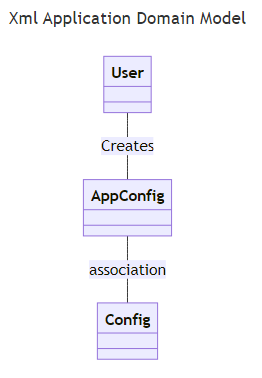
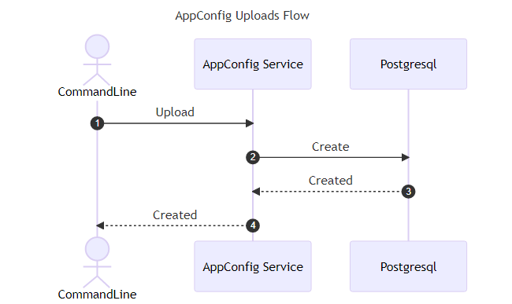
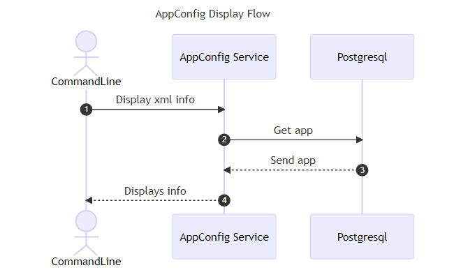
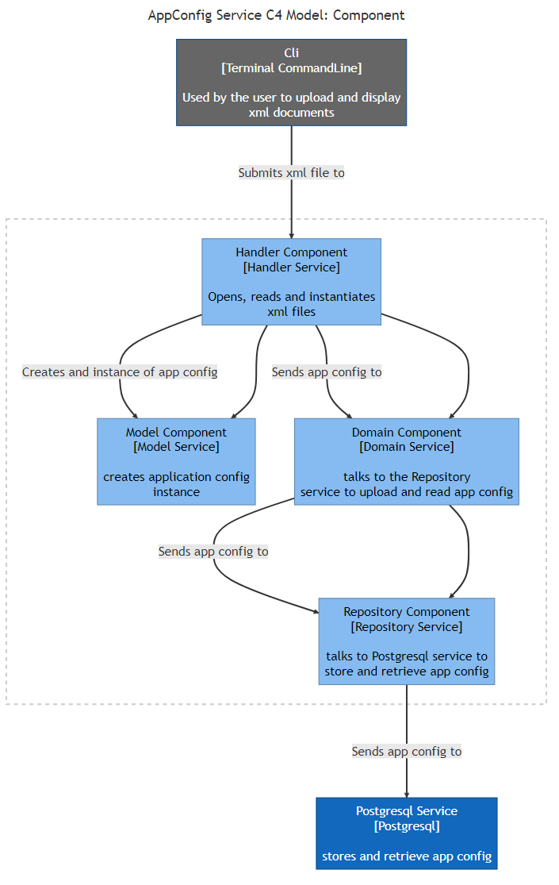

# XML Application

#### Domain Model

#### Requirements

1. Uploads a xml configuration file.

2. Display the information in an xml configuration file.

#### Upload Usecase

	Title: Uploads XML

	Actor: User

	Scenario: User uploads a xml configuration file from the commandline

#### Display Usecase

	Title: Display XML information

	Actor: User
	 
	Scenario: Users displays information on terminal from an xml configuration file
	

#### Architecture Model

